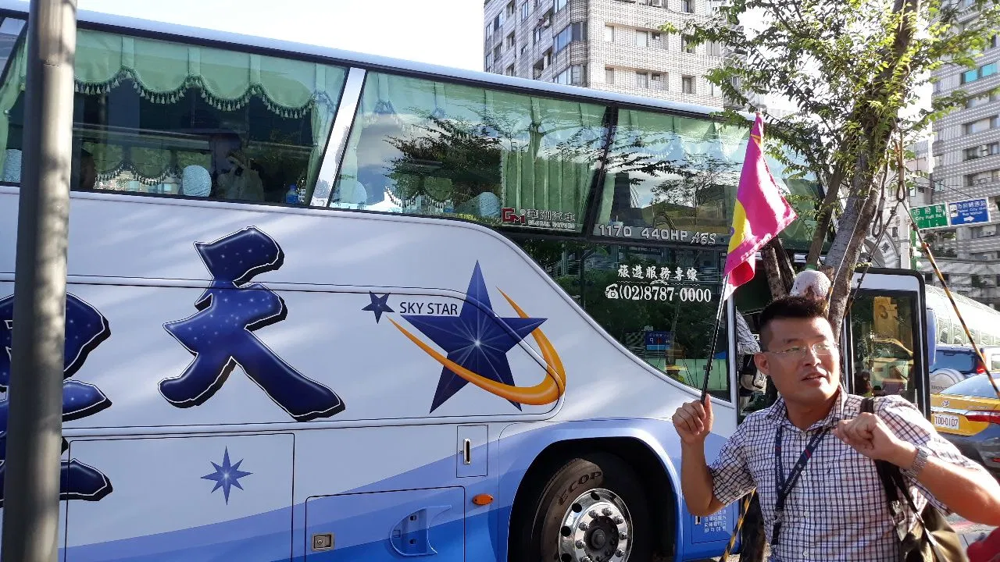
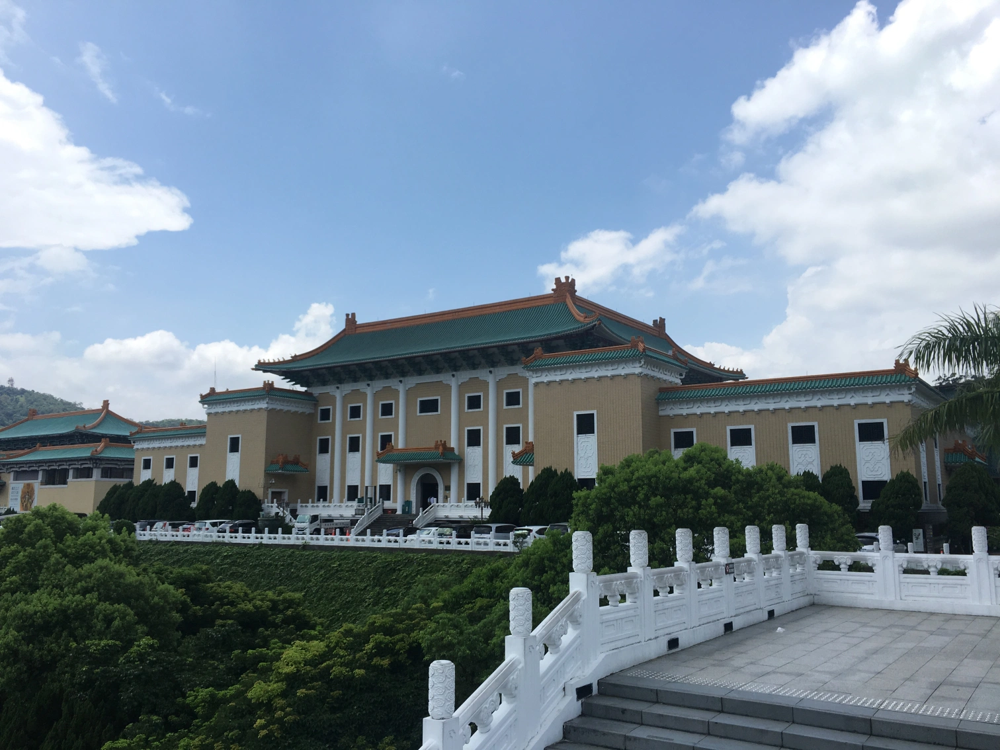
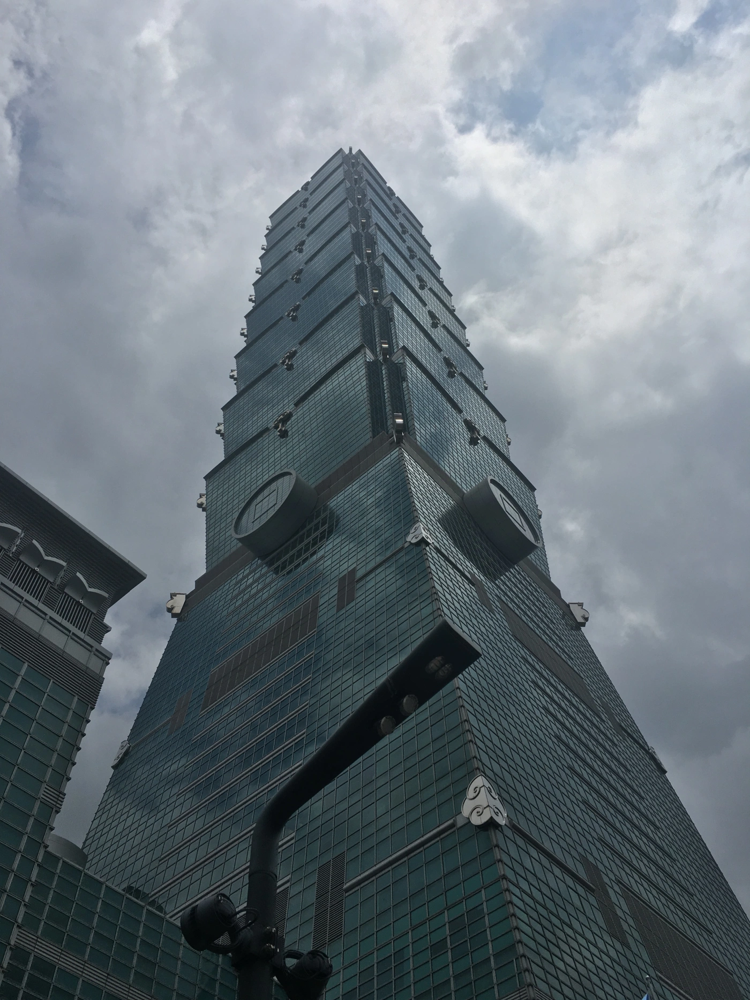
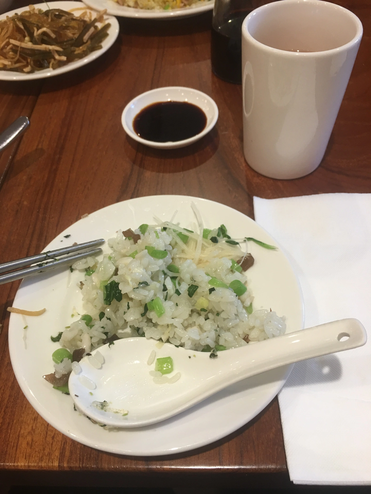
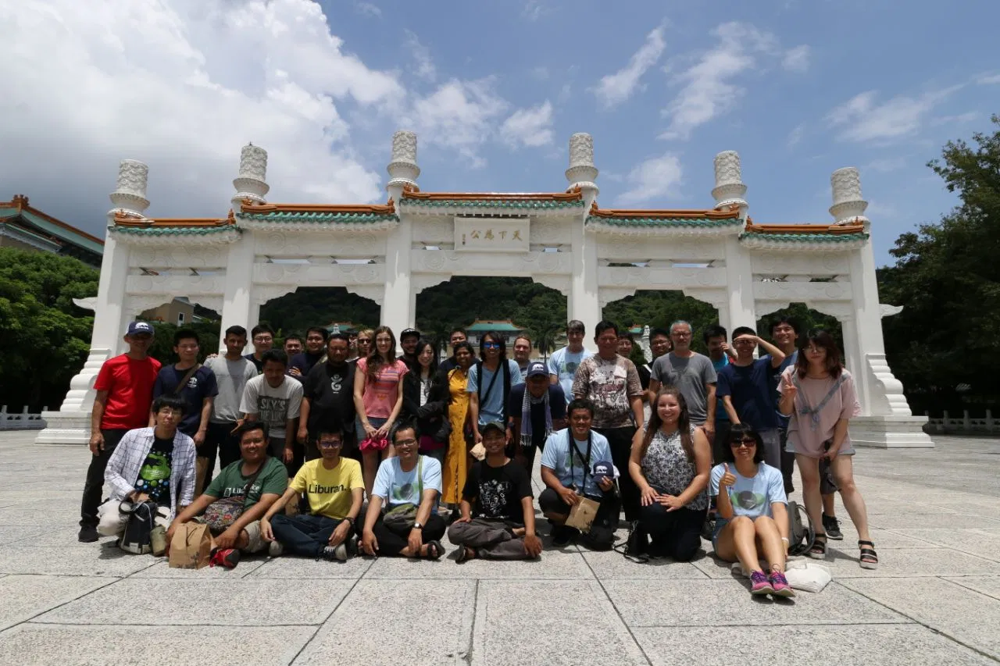

The conference was held in Taipei on 11th and 12th August, 2018. It was my first experience attending an international conference that makes it a great experience to me. It all started with my proposal being accepted for the conference. I was more excited when I was issued with a Taiwanese visa.

I was all prepared to board the flight from Indira Gandhi International Airport at 23:30. The climax came when I stopped at the check-in. The reason was I did not have a NOC from Nepalese Embassy. My teacher and a senior brother boarded the plane. I was left there at the terminal. The next day, I prepared all the documents and then headed for Taiwan. This time I was not stopped; however, the officials queried me a lot.

On the day of the conference, I was supposed to talk on the topic “Digital Literacy and open source in Developing countries like Nepal”. My presentation was on 12th August at 13:00 but because of the delay in flight, I was unable to present my slides.

  

    
  

  

    
  

  

    
  

  

    
  

  

    
  

Although I could not deliver the presentation, I got a chance to connect with some of the great personalities. I had interactions with them. They have promised me to help me on contributing to the opensource. All of them were friendly. The one day tour organised the next day was awesome. I enjoyed  and learned a lot.

I am sharing my experience with my colleges here and like to promote open source at my place.

I’d like to express my sincere gratitude to Max, Al Cho and the organising team for providing me with this opportunity and helping during the journey.